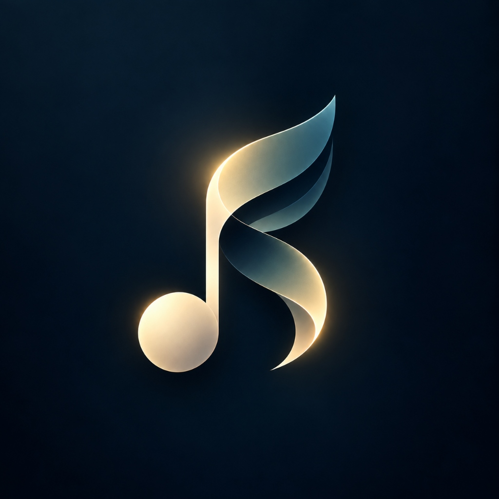

<p align="center">
  
</p>

<h1 align="center">Sielo</h1>

<p align="center">
  <strong>A tactile, lossless music streaming app crafted with Jetpack Compose & AndroidX Media3</strong>
</p>

<p align="center">
  <a href="https://kotlinlang.org"></a>
  <a href="https://developer.android.com"></a>
  <a href="https://developer.android.com/jetpack/compose"></a>
  <a href="https://developer.android.com/media/media3"></a>
  <a href="LICENSE"></a>
</p>

---

## ✨ Features

### 🎧 High-Fidelity Audio Streaming
- **Dual Stream Engine**: High-quality audio streaming powered by **YouTube Music InnerTube** and **JioSaavn** (lossless DES-decrypted 320kbps AAC).
- **Background Media3 Playback**: Rock-solid background audio playback and lock-screen controls via AndroidX Media3 `MediaSessionService`.
- **Intelligent Fallback**: Automatic stream resolution and format selection for instant playback with minimal buffering.

### 🎙️ Synchronized Lyrics
- **Real-Time Synchronized Lyrics**: Powered by LRCLIB with 1:1 millisecond timestamp synchronization.
- **Original Language Lyrics**: Preserves authentic lyrics in their native script (Devanagari, Gurmukhi, Hangul, Japanese, Roman, etc.).
- **Live Sync Fine-Tuning**: Built-in real-time offset adjustment controls (`−0.5s` / `+0.5s`) for on-the-fly timing adjustments.
- **Acoustic Calibration**: Automatic intro offset calibration for acoustic cuts and live edits.
- **Interactive Seeking**: Tap any lyric line to jump directly to that timestamp in the audio.

### 🎨 Modern UI & Tactile Design
- **Tactile Vinyl Player**: Interactive rotating vinyl disc with realistic vinyl groove textures and album artwork.
- **Animated Waveform Progress Bar**: Interactive, scrubbable animated waveform visualizer.
- **Floating Island Mini-Player**: Smooth floating mini-player with swipe-to-dismiss and persistent playback controls.
- **Custom Typography**: Tailored static type system featuring **Macondo** (Brand Identity), **Sora** (Headings, Stats, Active Lyrics), and **Urbanist** (Song titles, Metadata, UI elements).
- **Infinite Genre Marquee**: Smooth infinite looping genre carousels for effortless music discovery.

### 🔍 Search & Music Discovery
- **Instant Search**: Type-ahead search with immediate results, search dropdown suggestions, and recent search history.
- **Verified Official Artists**: Curated artist matching with official YouTube channel profile photos and avatar deduplication.
- **Curated Browse Categories**: Dynamic category tiles with themed backgrounds and genre recommendations.

### 📊 Listening History & Insights
- **Local Listening Events**: Stored in a local Room database tracking playback sessions, listening time, and repeated tracks.
- **Stats Overview**: Clean charts and summary metrics of top artists and songs.

---

## 🏛️ Architecture & Modular Structure

Sielo follows **Clean Architecture** principles and is organized into modular Gradle layers:

```text
Sielo
├── app/                  # Main Android Application & Compose UI
│   ├── ui/               # Screens, Themes & Tactile Components
│   └── viewmodel/        # StateFlow ViewModels
├── core-audio/           # Media3 ExoPlayer & Background Service
├── core-lyrics/          # LRCLIB API & Synced Lyrics Engine
├── core-network/         # InnerTube & JioSaavn Lossless Resolvers
└── core-database/        # Room DB & Listening Analytics
